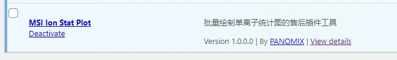
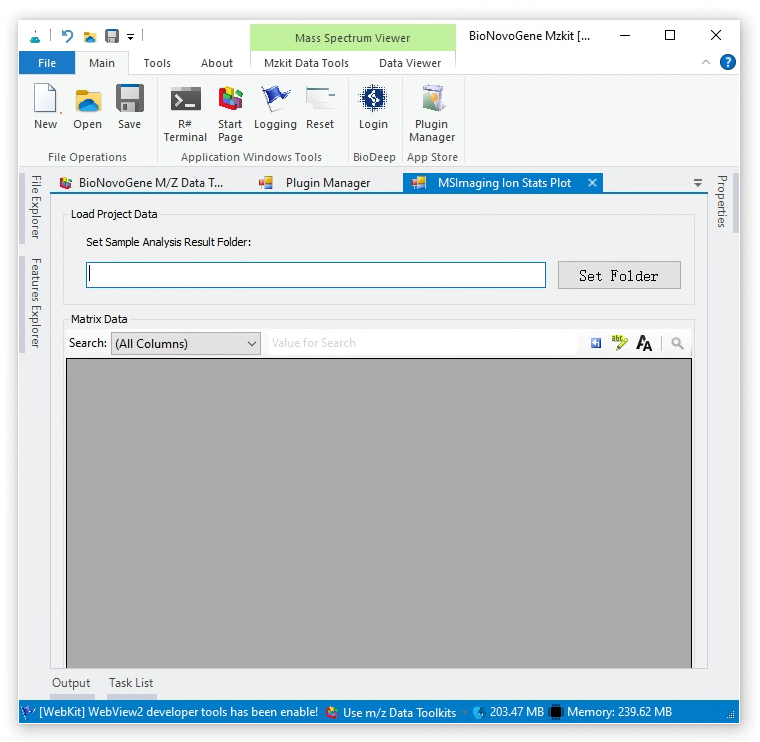
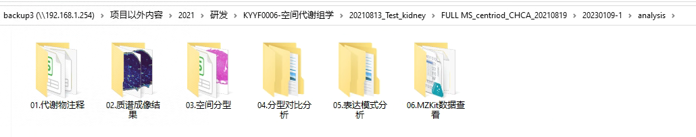
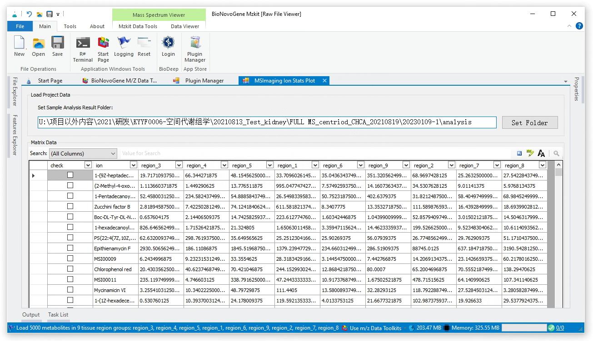
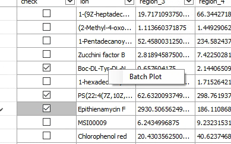

# 空间代谢组学批量绘图插件使用教程

<!-- 2023-01-10 -->

在空间代谢的自动化流程结果之中，会输出一批由脚本自动选择的离子的作图结果。这批离子列表可能在计算上存在有差异，但是可能大部分脚本的自动化离子选择的结果会与老师您的研究背景有一些偏离。则这个时候假若存在有重新绘图的需求，老师您可以通过【MSI Ion Stat Plot】插件来完成批量化的重新绘图操作。

在按照文档《[安装与管理MZKit插件](/zh/#install_plugin)》中的描述，进行插件安装之后，在MZKit工作站软件的插件管理器之中，老师您应该可以发现在插件列表之中存在有一个用于**批量绘制单离子统计图的售后插件工具**，此时，老师您可以通过点击插件标题``MSI Ion Stat Plot``打开这个插件。

在打开插件之后，老师您一般会看到如上图所示类似的界面。整个界面由两部分组成：顶部用于设定老师您的空间代谢组分析结果的文件夹路径，下半部分的表格则是进行对应的老师所感兴趣的离子的选择，以进行批量化的绘图操作。

## 操作步骤1：设定结果路径

当前的售后插件会需要基于一定的数据进行批量作图，这个数据来自于老师您在插件的顶部文本框之中所设定的结果文件夹路径。在老师您所设定的结果文件夹之中，文件夹应该是包含有类似的文件夹列表：

这个结果文件夹即为我们的目标文件夹。将这个文件夹的路径复制到输入框之中，接着只需要点击输入框右侧的【Set Folder】即可完成数据加载操作：

在插件界面中的下半部分表格中，可以发现已经填入了在老师您的空间代谢组学数据中所检测到的离子的表达结果。在表格的最左侧，每一行都存在有一个选择框，基于这个选择框的状态，插件将会进行对应的被选中的行所对应离子的可视化绘图操作。

在完成老师所感兴趣的离子的选择之后，这个时候老师您会需要在表格上点击鼠标右键，在弹出来的鼠标右键菜单中选择批量做图即可。

