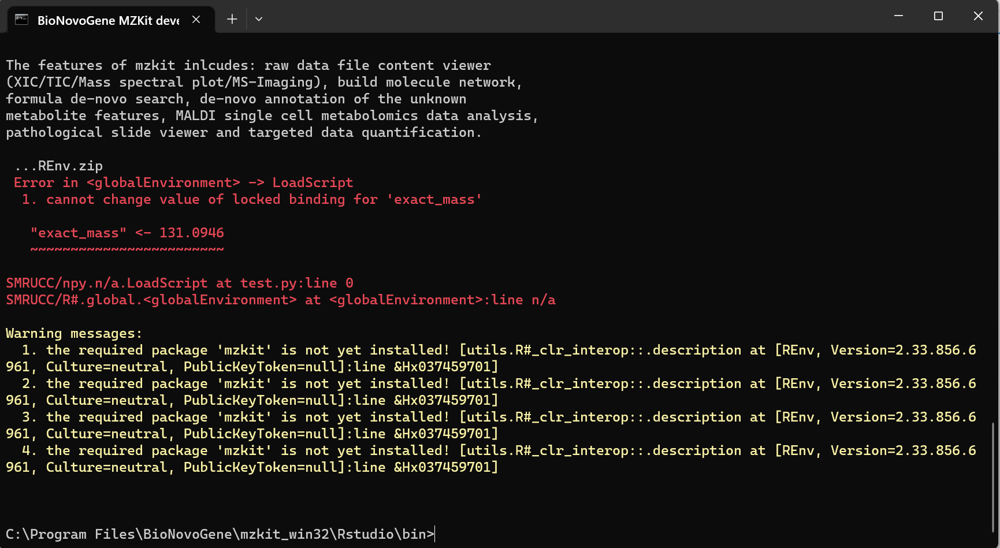

# 回答关于 MZKit 的编程问题

<!-- 2023-06-28 -->

> Dear Mr.Xie,
>
> I am the user of MZKit. When I run the MZkit workbench software, I encounter one problem like this Screenshot. When I use the '`developer command`', invoking '`r# test.py`', I meet this question. By the way, I have already tried to run '`install_local.cmd`'. Thank you so much!
>
> Sincerely,
>
> Jianing Yu.



今天很高兴收到了一封来自以为昵称为“三月兔”的老师的问题反馈来信，来信的内容大致意思为通过 MZkit 所自带的编程环境进行脚本执行，出现了一个符号被锁定的符号命名冲突问题。出现上面问题的原因主要是老师这边所命名的符号 exact_mass 和 mzkit 程序包之中的一个名为 exact_mass 的函数重名冲突了，所以 R#解释器报错无法修改 exact_mass 符号的值。


既然问题现在已经明确了，那么下面我将以这个问题为引子，来讲解如何调用 MZKit 程序包进行质谱数据编程分析。

## MZKit 脚本编程简单介绍

MZKit 软件是诺米代谢推出的一款主要应用于质谱数据分析的程序包，其主要分为 MZKit Server 和 MZKit Desktop 两部分组成。MZKit Server 是一个运行于服务器端的 R#编程环境的软件包，MZKit Desktop 则是运行于 MZkit Server 之上的 GUI 界面程序。二者一同绑定发布：老师您安装了 MZKit Workbench 之后，就相当于同时安装了 MZKit Server 和 MZKit Desktop。

因为目前 MZKit Desktop 的 GUI 界面上只实现了 MZKit Server 程序包中的一部分代码功能，所以假若老师您需要通过 MZKit 进行更加深入地质谱数据分析，则需要通过脚本编程的手段进行 MZKit 功能的调用。启用 MZKit 脚本执行的环境操作非常的容易，一般老师您只需要从开始菜单中打开【`BioNovoGene Developer CommandLine Tool`】即可启动 MZKit Server 编程环境：


在这个命令行环境之中可以支持老师您使用一下三种语言进行 MZKit Server 编程：

| 编程语言   | 文件拓展名 | 支持度                                                                                                                                                       |
| ---------- | ---------- | ------------------------------------------------------------------------------------------------------------------------------------------------------------ |
| R#         | \*.R       | 推荐使用 R#编程语言进行 MZKit 的编程调用，R#语言的解释器目前比较成熟稳定                                                                                     |
| Python     | \*.py      | MZKit 所附带的 Python.NET 解释器因为尚在开发中，许多 Python 语言的语法目前尚未在 Python.NET 中被实现，目前仅推荐进行简单的编程使用，无法支持复杂的逻辑操作   |
| JavaScript | \*.js      | 同样的，MZKit 所附带的 JavaScript.NET 解释器同样目前也是处于开发中的状态，目前仅推荐进行简单的编程使用，比较复杂的逻辑判断在 JavaScript.NET 并未被很好的支持 |

R#语言派生于 R 语言，其语法和编程逻辑和 R 语言比较虽然二者高度相似，但是相比较于 R 语言，在 R#语言中引入了大量的语言新特性。现在回到最初的邮件中的问题，之所以会出现邮件中所提到的符号冲突问题，是因为在 R#语言之中引入了一个显式符号申明的语法规则，但是目前 R#的解释器程序的栈环境还不完善所导致的，**老师这边可以尝试通过添加`let`关键词来避免这种符号冲突问题**，例如在下面的一段 R#脚本代码之中，我们实现了将具体的精确分子质量赋值给了 exact_mass 符号，然后根据这个符号计算出了所有正离子模式下的加合物的 m/z 值：

```r
require(mzkit);

imports "math" from "mzkit";

let exact_mass = 131.0946;
# evaluate mz from exact mass
let precursor_mz = exact_mass
|> math::mz(mode = "+")
|> as.data.frame()
;

print(precursor_mz);

#                        precursor_type   charge        M    adduct                   m/z   ionMode
# --------------------------------------------------------------------------------------------------
# <mode>                       <string> <double> <double>  <double>              <string> <integer>
# [M]+                           "[M]+"        1        1         0            "131.0946"         0
# [M+3H]3+                   "[M+3H]3+"        3        1   1.00728  "44.705476000000004"         0
# [M+2H+Na]3+             "[M+2H+Na]3+"        3        1   8.33459  "52.032790000000006"         0
# [M+H+2Na]3+             "[M+H+2Na]3+"        3        1   15.7662   "59.46439000000001"         0
# [M+3Na]3+                 "[M+3Na]3+"        3        1   22.9892   "66.68741800000001"         0
# [M+2H]2+                   "[M+2H]2+"        2        1   1.00728   "66.55457600000001"         0
# [M+H+NH4]2+             "[M+H+NH4]2+"        2        1   9.52055            "75.06785"         0
# [M+H+Na]2+               "[M+H+Na]2+"        2        1   11.9982           "77.545547"         0
# [M+H+K]2+                 "[M+H+K]2+"        2        1   19.9852   "85.53251700000001"         0
# [M+ACN+2H]2+           "[M+ACN+2H]2+"        2        1   21.5206            "87.06785"         0
# [M+2Na]2+                 "[M+2Na]2+"        2        1   22.9892           "88.536518"         0
# [M+2ACN+2H]2+         "[M+2ACN+2H]2+"        2        1   42.0338          "107.581123"         0
# [M+3ACN+2H]2+         "[M+3ACN+2H]2+"        2        1   62.5471  "128.09439700000001"         0
# [M+H]+                       "[M+H]+"        1        1   1.00728          "132.101876"         0
# [M+Li]+                     "[M+Li]+"        1        1     6.941  "138.03560000000002"         0
# [M-H2O+NH4]+           "[M-H2O+NH4]+"        1        1  0.023809          "131.118409"         0
# [M+H-2H2O]+             "[M+H-2H2O]+"        1        1  -35.0133   "96.08129500000001"         0
# [M+H-H2O]+               "[M+H-H2O]+"        1        1  -17.0027  "114.09186000000001"         0
# [M+NH4]+                   "[M+NH4]+"        1        1   18.0338  "149.12842300000003"         0
# [M+Na]+                     "[M+Na]+"        1        1   22.9892          "154.083818"         0
# [M+CH3OH+H]+           "[M+CH3OH+H]+"        1        1   33.0335  "164.12808900000002"         0
# [M+K]+                       "[M+K]+"        1        1   38.9632          "170.057758"         0
# [M+ACN+H]+               "[M+ACN+H]+"        1        1   42.0338          "173.128423"         0
# [M+2Na-H]+               "[M+2Na-H]+"        1        1   44.9712           "176.06576"         0
# [M+IsoProp+H]+       "[M+IsoProp+H]+"        1        1   61.0653           "192.15994"         0
# [M+ACN+Na]+             "[M+ACN+Na]+"        1        1   64.0158          "195.110365"         0
# [M+2K-H]+                 "[M+2K-H]+"        1        1    76.919           "208.01364"         0
# [M+DMSO+H]+             "[M+DMSO+H]+"        1        1   79.0212           "210.11582"         0
# [M+2ACN+H]+             "[M+2ACN+H]+"        1        1   83.0604  "214.15497000000002"         0
# [M+IsoProp+Na+H]+ "[M+IsoProp+Na+H]+"        1        1   84.0551  "215.14971000000003"         0
# [2M+H]+                     "[2M+H]+"        1        2   1.00728          "263.196476"         0
# [2M+NH4]+                 "[2M+NH4]+"        1        2   18.0338          "280.223023"         0
# [2M+Na]+                   "[2M+Na]+"        1        2   22.9892          "285.178418"         0
# [2M+K]+                     "[2M+K]+"        1        2   38.9632  "301.15235800000005"         0
# [2M+ACN+H]+             "[2M+ACN+H]+"        1        2   42.0338          "304.223023"         0
# [2M+ACN+Na]+           "[2M+ACN+Na]+"        1        2   64.0158          "326.204965"         0
# [M+H-C12H20O9]+     "[M+H-C12H20O9]+"        1        1  -307.103 "-176.00857499999995"         0
```

写到这里，“三月兔”老师的问题其实已经回答完毕了。如上面的实质上是老师在脚本中定义的符号与 mzkit 程序包中的符号冲突了产生的。那如果我们想要知道 mzkit 程序包之中定义有哪些函数符号，以及这些函数符号该如何使用的话，我们应该怎么做呢？在这里，我们可以通过查阅 mzkit 程序包自带的帮助文档来解决上面的问题，下面我们将简单学习下如何查阅 mzkit 的文档。

## MZKit 程序包文档查阅

一般而言，mzkit 工作站软件的安装位置，假若使用默认的 C 盘位置的话，则这个时候，老师可以从下面的文件夹路径访问帮助文档：

```
C:\etc\r_env\library\mzkit\package\vignettes
```


可以看见在 vignettes 文件夹之中存在有 4 个子文件夹，分别对应 mzkit 程序包之中的 4 大分析模块：

| 文件夹名/模块名称 | 功能说明                                                                                                     | 模块导入操作                     |
| ----------------- | ------------------------------------------------------------------------------------------------------------ | -------------------------------- |
| mz_quantify       | 用于靶向代谢组学定量计算分析的质谱数据分析功能模块，主要应用于处理 LC-MSMS 的 MRM 模式数据定量计算分析       | `imports "*" from "mz_quantify"` |
| mzDIA             | 用于进行标准谱图参考库构建或者代谢物推断注释的工具模块，里面主要包含有分子网络分析工具和 MetaDNA 注释工具    | `imports "*" from "mzDIA"`       |
| mzkit             | mzkit 程序包的主模块，里面包含有质谱原始数据文件读取模块，化学信息学计算分析模块，质谱图提取以及数据处理模块 | `imports "*" from "mzkit"`       |
| mzplot            | 主要用于质谱数据作图的工作模块，里面包含有色谱图绘制函数，空间代谢组学的质谱成像渲染函数等数据可视化工具     | `imports "*" from "mzplot"`      |

### 1. 根据帮助文档导入分析模块

如果需要引用相应的模块进行编程，可以通过`imports`语句进行导入操作即可。相应的导入命令，老师这边可以通过打开相应模块文件夹中的帮助文档网页文件查看即可，例如我们在这里打开帮助文档：

```r
# file:///C:/etc/r_env/library/mzkit/package/vignettes/mzkit/math.html
require(mzkit);

#' the R# math module
imports "math" from "mzkit";
```


在帮助文档的开头，有一段代码提示了我们如何将对应的模块在脚本中进行导入操作，例如上面所展示的一段代码，就是将 mzkit 模块之中的 math 功能模块进行了加载操作，然后 math 模块之中的函数就都会被加载进入了我们的脚本编程环境之中。在上面的代码展示是以 R#脚本语言来展示的，假若是 python 语言，则可以通过下面的代码例子来进行加载操作，例如：

```python
import mzkit
#' the R# math module
from mzkit import math
```

### 2. 使用分析模块中的函数

在完成了上面的分析模块导入操作之后，我们就可以在脚本中引用相应的函数来进行质谱数据相关的数据分析操作了，例如，假若我们需要计算两个`m/z`值之间的 ppm 误差，我们可以在导入 math 分析模块之后，直接使用 ppm 函数来进行计算操作：

```r
require(mzkit);
imports "math" from "mzkit";

print(ppm(100.0123, 100.0133));
# [1]  9.99867
```

### 3. 一些常用的 MZKit 分析函数

下面附上在 mzkit 程序包中提供的比较常用的一些质谱数据分析相关的函数，更加多的函数使用方法，老师这边可以查阅 mzkit 的帮助文档或者与我电子邮件沟通获取帮助信息。

#### 1. 从化学式中计算出精确分子质量

```r
require(mzkit);

#' The chemical formulae toolkit
imports "formula" from "mzkit";

print(formula::eval(["CH3CH3", "H", "O3", "Na2CH2"]));
# [1]      30.0469  1.00782  47.9847  59.9952
```

#### 2. 读取质谱原始数据文件，并提取出所有二级质谱图

```r
require(mzkit);

#' biodeep mzweb data viewer raw data file helper
imports "mzweb" from "mzkit";

let file = "C:\Program Files\BioNovoGene\mzkit_win32\demo\003_Ex2_Orbitrap_CID.mzXML";
let ms2_spectrum = open.mzpack(file) |> ms2_peaks(
    centroid = TRUE,
    norm = FALSE,
    filter.empty = TRUE,
    into.cutoff = 0);

print(ms2_spectrum);
```

#### 3. 计算任意两个二级质谱图之间的相似度，并绘制比对图

```r
require(mzkit);

#' the R# math module
imports "math" from "mzkit";
#' m/z data operator module
imports "data" from "mzkit";
imports "visual" from "mzplot";

# define the spectrum from dataframe
let ms2_a = libraryMatrix(data.frame(mz = [100, 200, 301], intensity = [1, 0.9, 0.33]));
let ms2_b = libraryMatrix(data.frame(mz = [100, 203, 301], intensity = [0.5, 0.3, 1]));

# evaluate of the spectrum similarity scores
# cos score
str(as.list(math::cosine(ms2_a, ms2_b)));
# spectral_entropy similarity
print(math::spectral_entropy(ms2_a, ms2_b));

# List of 10
#  $ forward    : num  0.535916
#  $ reverse    : num  0.680894
#  $ jaccard    : num  0.5
#  $ entropy    : num  0.523602
#  $ mirror     : num  0.5
#  $ cosine     : num  0.535916
#  $ query      : List of 4
#  ..$ id        : chr "MS Matrix"
#  ..$ mz        : num 0
#  ..$ scan_time : num 0
#  ..$ intensity : num 0

#  $ reference  : List of 4
#  ..$ id        : chr "MS Matrix"
#  ..$ mz        : num 0
#  ..$ scan_time : num 0
#  ..$ intensity : num 0

#  $ alignments : any [1:4] [
#      ..List of 4
#  ..$ mz    : num  100
#  ..$ query : num  1
#  ..$ ref   : num  0.5
#  ..$ da    : chr "0"

#      ..List of 4
#  ..$ mz    : num  200
#  ..$ query : num  0.9
#  ..$ ref   : num 0
#  ..$ da    : chr "NaN"

#      ..List of 4
#  ..$ mz    : num  203
#  ..$ query : num 0
#  ..$ ref   : num  0.3
#  ..$ da    : chr "NaN"

#      ..List of 4
#  ..$ mz    : num  301
#  ..$ query : num  0.33
#  ..$ ref   : num  1
#  ..$ da    : chr "0"


# ]
#  $ nhits      : int 2

# [1]  0.499453

# plot specrum alignment
bitmap(file = "/spectrum-alignment.png") {
    mass_spectrum.plot(ms2_a, alignment = ms2_b);
}
```


#### 4. 绘制质谱图

```r
require(mzkit);

#' m/z data operator module
imports "data" from "mzkit";
imports "visual" from "mzplot";

# construct a specrum object from a dataframe
let spectrum = libraryMatrix(data.frame(
    mz = [100, 200, 301],
    intensity = [1, 0.9, 0.33]
));

bitmap(file = "/spectrum.png") {
    plot(spectrum);
}
```


