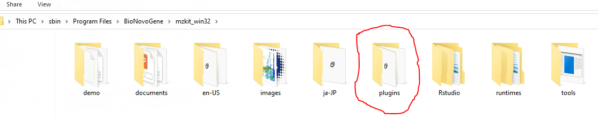
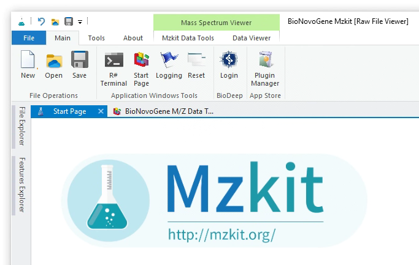
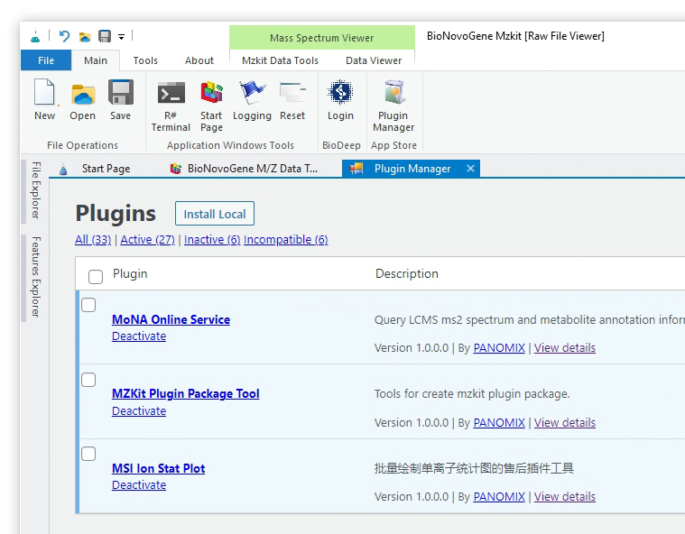

# 安装与管理MZKit插件

<!-- 2022-12-31 -->

MZKit桌面工作站软件目前采取部分开源的措施进行软件发布：工作站软件的主体部分免费开源发布，某些额外的功能则通过闭源插件的形式进行非公开授权。在这里我们将为您介绍当您从诺米代谢的科研服务售后处获取得到MZKit工作站软件的插件模块之后，如何进行安装以及使用。

> 注：MZKit桌面工作站软件的部分非公开插件模块是与软件的具体大版本绑定授权的，所以当老师您获取了一个MZKit软件插件之后，在获取新版本插件更新包之前，请勿随意升级MZKit软件版本。

## 安装插件模块

老师您从售后部分获取得到的MZKit软件插件模块可能分为两种文件类型：

1. 单独的DLL文件
2. 插件包

对于单独的DLL文件，老师您会需要在文件浏览器中打开MZKit工作站软件的安装文件夹位置，例如默认的文件夹位置：``C:\Program Files\BioNovoGene\mzkit_win32``，一般可以看见一个名为``plugins``的文件夹：

这个时候老师您只需要直接将DLL文件复制到这个文件夹之中即可。在完成文件复制操作之后，老师您会需要重新启动MZKit工作站软件，接着在主菜单中的【App Store】菜单栏点击【Plugin Manager】按钮，进入插件管理器页面。

在下面所示的插件管理器页面之中，老师您一般可能会看见有一些按钮和功能界面：

+ ``Install Local``按钮用于进行插件包的安装操作
+ ``All``,``Active``,``Inactive``,``Incompatible``显示了当前工作站软件上的一些插件统计
+ 最后，下面的表格则展示了当前的在工作站软件内可以被看见的插件的列表

## 调用插件

大部分的软件插件存在的意义在于对当前现有软件的功能进行拓展。在MZKit软件之中，除了部分插件会以功能整合的方式集成在软件的不同的功能菜单之中，大部分的插件会需要老师您手动从插件管理器页面之中进行手动调用来打开。

进行插件的手动打开非常的简单，老师您只需要在插件列表上，点击插件名称的超链接即可。