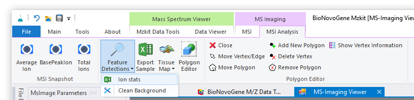

# 质谱成像离子峰简单统计

<!-- 2022-07-29 -->

按照[《查看质谱成像原始数据文件》](#view-ms-imaging)的操作在MZKit软件之中打开质谱成像原始数据文件之后，假若需要了解原始数据文件之中的离子分布信息，可以按照下面的操作流程进行获取：

## 执行离子信息统计

在打开质谱成像文件查看器之后，通过顶部的Ribbon菜单栏首先切换至【MSI Analysis】快捷菜单栏。在第二个菜单分组中，存在有【Feature Detections】功能菜单。点击这个特征检测的功能菜单，在弹出的下拉框菜单中将会看见出现一个名为【Ion Stats】的菜单。执行这个菜单我们将可以得到在质谱成像原始数据之中所检测到的所有的离子峰列表。

