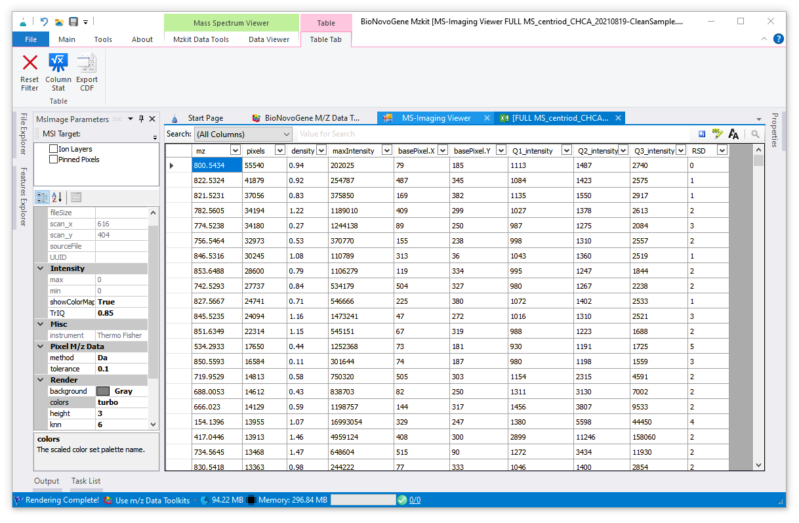

# 质谱成像离子峰简单统计

<!-- 2022-07-29 -->

按照[《查看质谱成像原始数据文件》](#view-ms-imaging)的操作在MZKit软件之中打开质谱成像原始数据文件之后，假若需要了解原始数据文件之中的离子分布信息，可以按照下面的操作流程进行获取：

## 执行离子信息统计

在打开质谱成像文件查看器之后，通过顶部的Ribbon菜单栏首先切换至【MSI Analysis】快捷菜单栏。在第二个菜单分组中，存在有【Feature Detections】功能菜单。点击这个特征检测的功能菜单，在弹出的下拉框菜单中将会看见出现一个名为【Ion Stats】的菜单。执行这个菜单我们将可以得到在质谱成像原始数据之中所检测到的所有的离子峰列表。

进行离子列表信息的统计时间长短会取决于质谱成像原始数据文件的大小，一般根据MZKit所处的计算机系统的CPU计算速度硬件配置，MZKit会在1分钟以内完成所有离子信息统计。下面的表格中展示执行上面的【Ion stats】功能之后所会出现的结果表格：

在上面所展示的表格中，每一列的统计信息所对应的含义为：

|列名称|含义|取值范围|
|-----|-----|------|
|mz|离子的质荷比|质谱成像实验的质谱扫描范围|
|precursor_type|根据代谢物的formula计算出的精确分子质量与mz所匹配的母离子加合物信息（仅会出现于代谢物搜索功能结果中）||
|pixels|当前的离子在整张切片上的像素点总数|``[0, width x height]``|
|density|当前的离子的像素点在整张切片上的平均分布密度，密度值越低，说明分布越稀疏，过低的密度值说明离子可能是噪声点|``[0, 1]``|
|maxIntensity|当前离子在整张切片上的最大响应度值|``[0, 正无穷]``|
|basePixel.X|当前离子最大响应度值的像素点坐标X|``[0, width]``|
|basePixel.Y|当前离子最大响应度值的像素点坐标Y|``[0, height]``|
|Q1_intensity|当前离子在所有像素点上响应度值的25%四分位数||
|Q2_intensity|当前离子在所有像素点上响应度值的50%四分位数||
|Q3_intensity|当前离子在所有像素点上响应度值的75%四分位数||
|RSD|当前离子在所有像素点上的响应度值的相对变异系数RSD统计计算结果||

