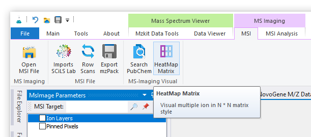
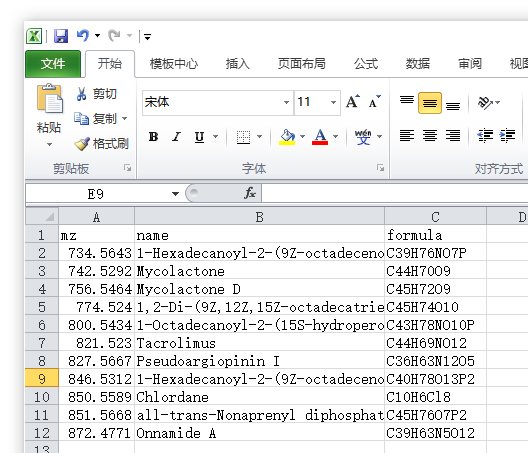
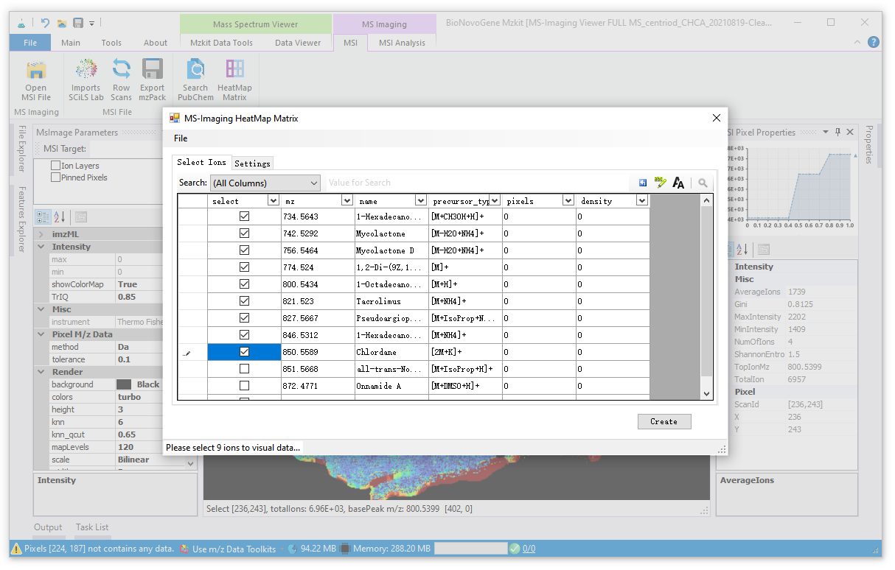
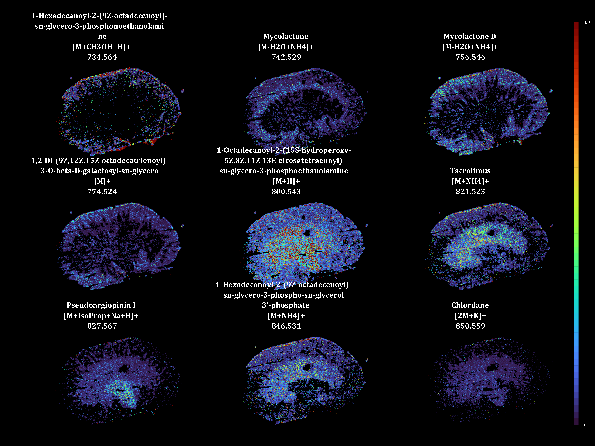

# 质谱成像矩阵热图数据可视化

<!-- 2022-08-04 -->

基于MZKit可以以矩阵热图的方式查看来自于同一张样本切片上的不同代谢物离子的共表达共定位数据可视化。在参照[《查看质谱成像原始数据文件》](/zh/#view-ms-imaging)方法打开原始数据文件之后，在顶部的Ribbon菜单栏之中的【MSI】功能菜单标签页选择执行【HeatMap Matrix】菜单按钮。

进行质谱成像矩阵热图的数据可视化，一般是针对所感兴趣的代谢物列表来进行的。所以在点击上面所提到的功能按钮之后，MZKit会弹出文件打开对话框，要求输入一个Excel表格，Excel表格中应该是会需要按照如下格式记录代谢物列表信息：

在上图所展示的表格之中，列信息具有如下含义：

+ name，感兴趣的目标代谢物的代谢物名称
+ formula，感兴趣的目标代谢物的化学式，MZKit会需要依照本列的信息进行精确分子质量计算，基于精确分子质量的计算结果再计算出理论的mz用于代谢物离子的质谱成像数据可视化
+ mz（可选），感兴趣的目标代谢物离子的mz信息，假若这一列数据缺失，则MZKit会按照所有可能的母离子加合物形式根据化学式计算出的精确分子质量计算出所有可能的理论mz信息

> 对于如何进行感兴趣的代谢物的信息查找，可以阅读帮助文档[《质谱成像代谢物离子搜索》](#msi-metabolite-query)

基于文件打开对话框完成代谢物列表的读取之后，MZKit软件会弹出一个离子选择的对话框。根据所需要进行质谱成像数据可视化的矩阵网格大小，选择出目标数量的离子列表：

> 假若所需要进行矩阵热图质谱成像数据可视化的网格大小为3x3，则应该选择9个离子；假若网格大小为2x3，则应该选择6个离子；以此类推

完成离子列表的选择之后，点击【Create】按钮，在弹出的文件保存对话框中完成目标文件路径选择后即可得到一张可以用于可视化所感兴趣的目标代谢物离子列表的矩阵热图可视化结果：

