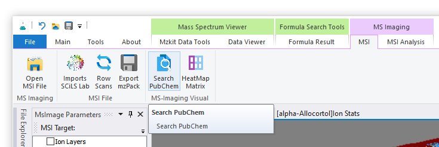
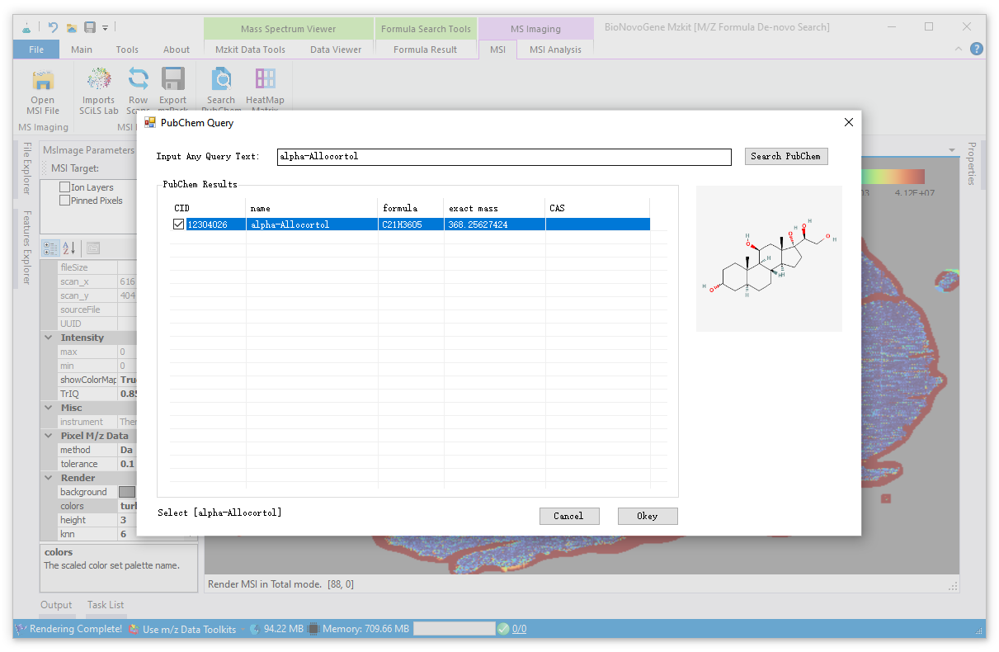
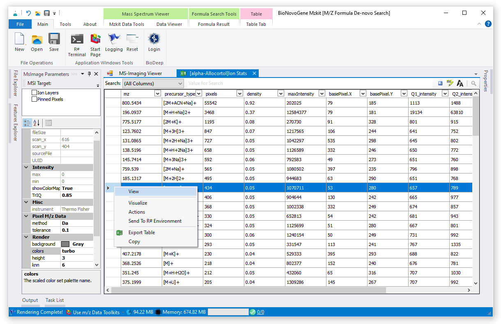
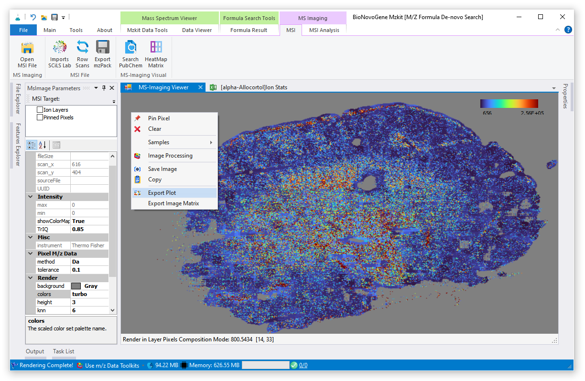

# 质谱成像代谢物离子搜索

<!-- 2022-07-29 -->

在参照[《查看质谱成像原始数据文件》](/zh/#view-ms-imaging)方法打开原始数据文件之后，在顶部的Ribbon菜单栏之中的【MSI】功能菜单标签页选择执行【Search PubChem】菜单按钮。

将会弹出PubChem数据库的搜索对话框。在对话框窗体的顶部输入栏之中输入需要进行查找的代谢物相关信息，例如代谢物名称、CAS编号等信息；之后点击输入框右边的【Search Pubchem】按钮进行数据库查询搜索。MZKit会根据相应的信息在PubChem数据库之中进行查找，返回对应的结果列表显示在下方。选中对应的代谢物信息的行数据，点击【Okay】按钮进行相应的离子信息在质谱成像原始数据文件之中的查找。

> 注意：基于所安装MZKit软件的计算机所处的网络与PubChem数据库服务器之间的网络连接质量，在网络访问速度较慢的情况下，MZKit软件进行代谢物信息查询的时候可能会出现卡顿假死。此时请耐心等待查询数据在网络中的传输完成。

通过上面的操作可以得到经过代谢物的formula信息计算出的精确分子质量在不同的前体母离子加合物组合的形势下计算出来的理论mz离子信息。这些mz离子对象可能在目标质谱成像原始数据文件之中没有被检测到不存在，则此时相应的结果表格中的【Pixels】列数据的结果值等于0。

> 关于结果离子表格信息中的列的具体含义，可以参考[《质谱成像离子峰简单统计》](#msi-ions)

在上面的离子信息表格之中通过行表头选中某一行所代表的离子信息，基于右键快捷菜单，选中【View】功能菜单，即可查看对应所选中的行数据中的mz值在质谱成像原始数据中的单分子质谱成像结果。

假若需要进行单分子质谱成像结果的保存操作，可以在质谱成像的画布上，通过鼠标右键菜单执行【Export Plot】功能菜单。在弹出来的文件保存对话框中设定所需要保存的文件路径之后，MZKit将会导出当前所可视化的目标代谢物离子的单分子质谱成像图。

