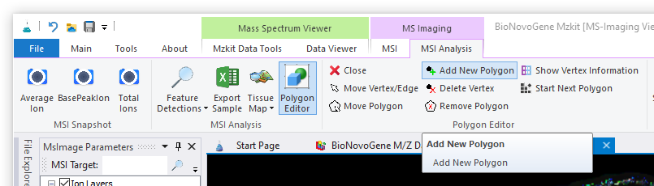
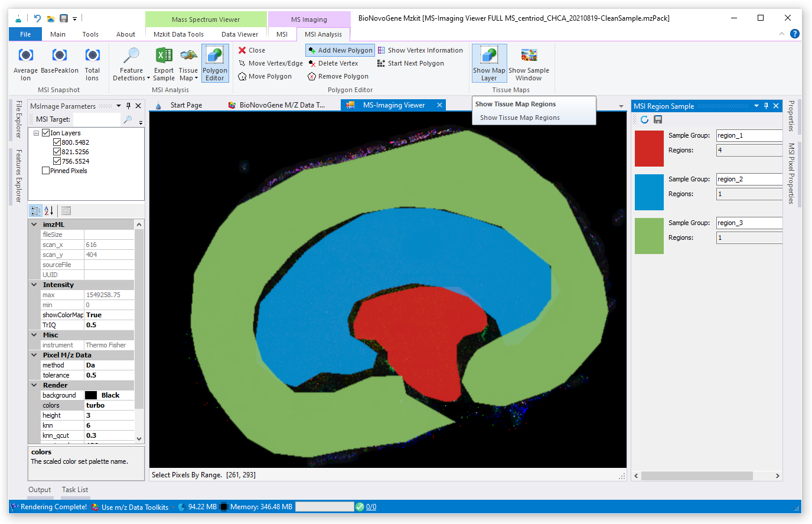

# 空间代谢组学组织手动划分区域

<!-- 2022-08-08 -->

在进行空间代谢组学数据分析的时候，相对于普通的非靶向数据分析所比较的对象为样本分组，我们在空间代谢组学数据分析中所需要进行比较的对象则是样本切片上的组织区域的差异：例如癌症肿瘤组织区域与正常组织区域之间的差异。在这个过程之中我们则会涉及到对所需要进行比较的组织区域划分的问题。针对组织区域划分，一般有两种选择：

1. 通过算法进行自动组织区域划分
2. 通过可视化软件进行手动的组织区域划分

第一种情况一般是基于无监督聚类的数据分析算法来完成。在诺米代谢的空间代谢组学数据分析流程之中，可以基于单细胞数据分析算法进行准确度比较高的组织区域自动化划分，用于后续数据分析。通过可视化软件进行手动的组织区域划分，一般是针对于比较有经验的医生，通过HE染色或者其他的组织特殊染色的方法进行所需要进行比较的感兴趣的组织区域的划分。

基于MZKit软件，可以实现质谱成像下机原始数据的空间区域手动划分操作。（在这里我们假设您已经可以通过帮助文档中的内容[进行质谱成像原始数据的加载操作](#view-ms-imaging)。）

> 假若您是诺米代谢的空间代谢组学项目客户，则有需求进行手动分区的个性化项目分析需求的时候，我们会将您的样本下机原始数据快照发送给您，您只需要在快照数据上通过MZKit软件进行手动分区，之后导出组织分区图矩阵数据回传给我们的项目管理员即可。

## 手动创建分区多边形

首先通过顶部的Ribbon菜单切换至【MSI Analysis】功能菜单标签页面，随后需要点击【Polygon Editor】按钮进行多边形编辑和创建模式。在多边形编辑模式下可以进行组织区域的手动划分。

### 1. 添加一个多边形

在顶部的Ribbon菜单之中，点击【Add New Polygon】按钮，该按钮将会变为高亮模式表示已经被选中。此时我们将可以在质谱成像图上进行多边形数据的添加操作。

通过在质谱成像图上点击鼠标左键，我们在添加多边形模式下可以一次插入多边形的连接点。通过不断点击，直至将所需要进行数据分析的目标区域圈选出来：

如上图所示，我们完成一个多边形区域的创建之后，可以通过鼠标右键菜单，依次选择【Samples】之后【Add Sample】即可将我们所创建的多边形区域添加为一个样本分组。

假若在样本上存在有多个不连续的多边形的情况，则会需要在完成了前一个多边形创建之后，点击顶部Ribbon菜单之中的【Start Next Polygon】按钮进行新的独立区域的创建和编辑操作。

> 如何理解组织区域：在MZKit之中，一个组织区域是由一个或者多个独立的多边形区域构成的。所以在MZkit中所创建的某一类型组织的区域信息，可以包含有多个相互独立的多边形数据。这些独立的多边形区域在计算的时候仍然会合并为一个大区域进行相应的离子表达数据的读取操作。

### 2. 编辑多边形

**我们在将多边形数据添加为样本分组信息之前，多边形数据都是可以被直接编辑的**。基于多边形编辑，我们可以调整目标区域的形状，大小等信息。进行多边形调整，我们可以通过顶部的Ribbon菜单之中的若干功能按钮来完成：

+ 【Move Vertex/Edge】可以使我们通过鼠标左键拖拽调整多边形中的某一个节点位置
+ 【Move Polygon】可以使我们通过鼠标左键拖拽整体平移某一个多边形的位置
+ 【Delete Vertex】可以使我们通过鼠标左键单击删除某一个多边形节点
+ 【Remove Polygon】可以使我们通过鼠标左键单击整体删除某一个多边形区域

> 请注意：在将多边形添加为样本分组信息之后，将无法再进行对当前分组内的对应的多边形编辑操作。

### 3. 自动填充分区信息

为了方便进行分区数据的辨识，我们在完成了多边形的创建工作之后，需要为所创建的多边形进行相应的标签填写以及唯一颜色填充操作。一般情况下，我们会需要手动为多边形样本区域进行一些有意义的命名操作，设定自己所想要的分析颜色等。但是假若您并不想要手动完成，则可以通过【MSI Region Sample】窗口内的【Auto Sampleinfo】按钮进行信息的自动化填充：

在点击此按钮之后，会弹出对话框确认是否执行自动填充。选择【确认】后，程序会自动分配颜色以及使用顺序编码所添加的样本区域编号

### 4. 展示手动分区叠加图

可以通过点击顶部的Ribbon菜单之中的【Show Map Layer】按钮，MZKit将会显示所创建的手动选区结果。再次点击【Show Map Layer】按钮取消选中状态，则手动选区结果将会被隐藏。

## 比较代谢物在不同分区间的差异表达

在左边的质谱成像离子浏览器之中，在已经完成了组织区域分区创建的情况下，我们可以针对某一个代谢物单分子在所划分的不同组织区域之间的表达情况进行差异比较，操作如下：

1. 在质谱成像离子浏览器的输入框之中，填入所关注的代谢物的离子mz质荷比值
2. 在浏览器离子树之中选中目标离子的树节点
3. 通过鼠标右键调出快捷功能菜单，选择【Show Plot】菜单，然后在弹出的绘图类型菜单中选择【箱式图】【柱状图】或者【小提琴图】其中的某一种即可

> 对于所关注的想要进行差异分析的代谢物的mz的选取，您可以参阅帮助文档[《质谱成像代谢物离子搜索》](#msi-metabolite-query)

## 导出组织分区图矩阵数据

如果需要将手动分区数据提交至诺米代谢的空间代谢组学数据分析流程之中，可以在按照上面的操作步骤完成选区之后，通过依次点击顶部的Ribbon菜单之中的【Tissue Map】->【Export Regions】按钮进行手动数据分析的结果导出。

在获取得到分区结果的CDF矩阵数据文件之后，将改CDF矩阵数据文件提交至与您进行项目沟通的技术支持或者科研销售，完成将手动分区的结果反馈回数据分析服务部门。数据分析部门在接收到相应的分区结果CDF文件之后，将会在一个工作日之内完成相应的空间代谢组学自动化数据分析，并在三个工作日内返回数据分析结果报告给您。

## 导入组织分区图矩阵数据

在诺米代谢的空间代谢组学数据分析流程报告交付结果之中，你可以从结果文件夹``06.MZKit数据查看``中获取得到两个数据文件：

+ ``CleanSample.mzPack``或者``CleanSample.mzImage``文件可以用于导入MZKit软件之中进行质谱成像结果查看。（经由MZKit相关功能可以转换为imzML开源格式导入到其他软件之中进行结果查看）
+ ``tissue_morphology.cdf``文件为空间代谢组学自动化流程基于相应的算法所创建的自动化分区结果。

假若需要将线下自动化流程分析的分区结果导入MZkit之中进行数据查看，可以通过顶部的Ribbon菜单栏，依次点击菜单按钮【Tissue Map】->【Export Regions】打开对应的CDF文件即可。

