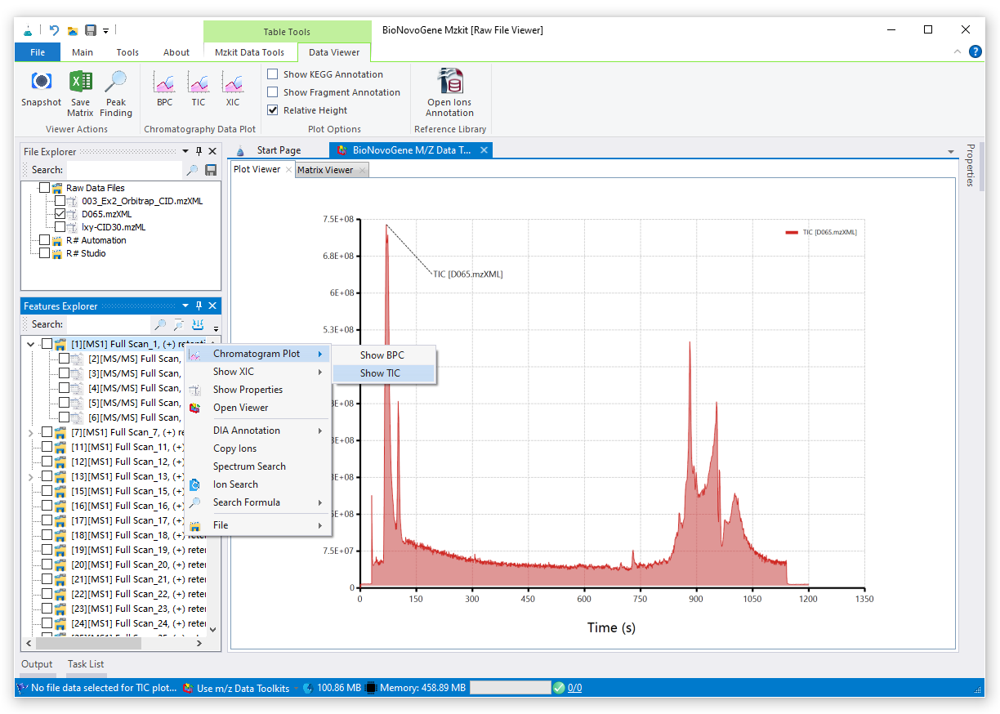
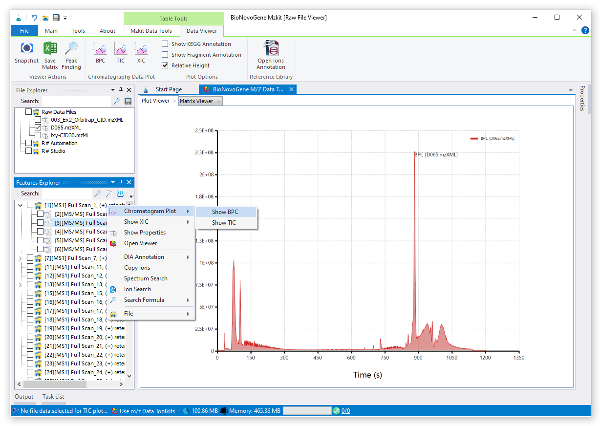
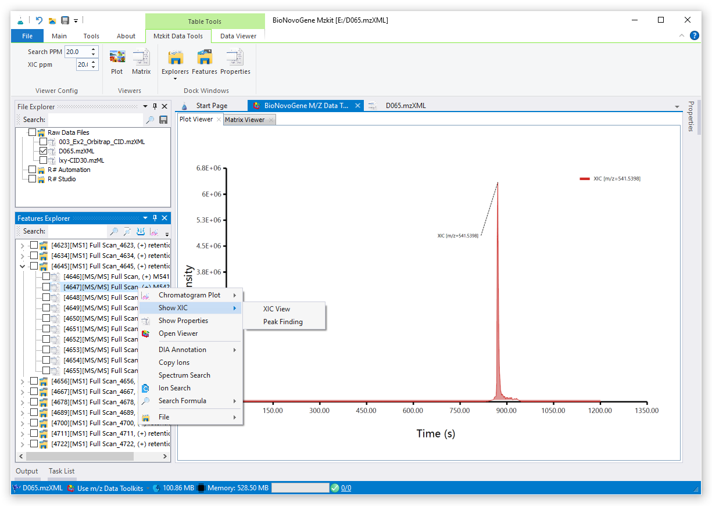
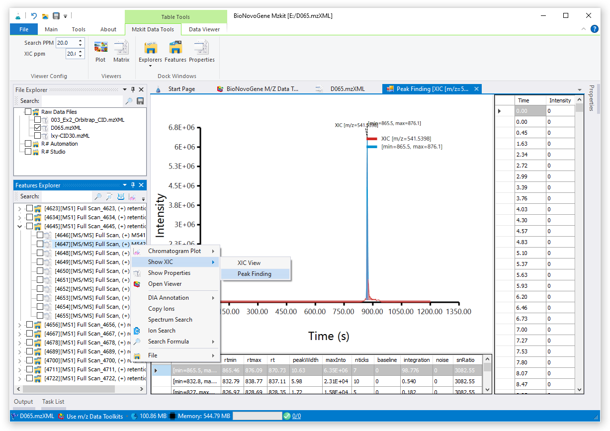
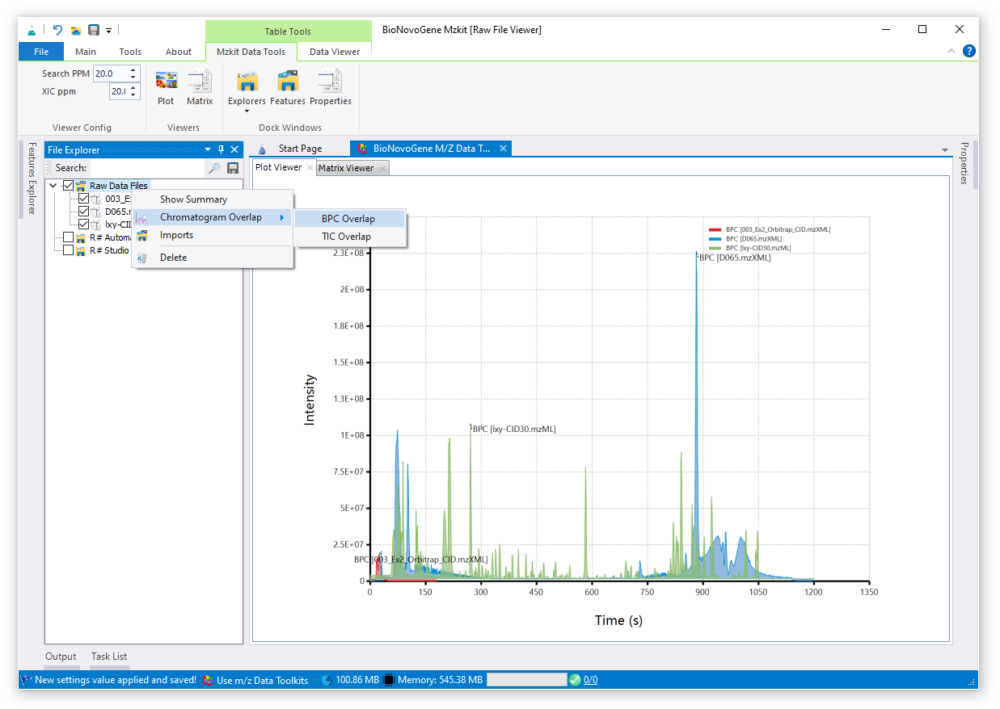
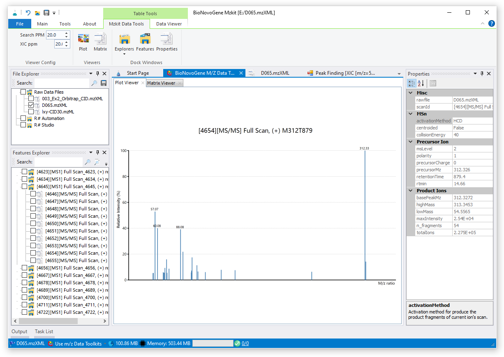
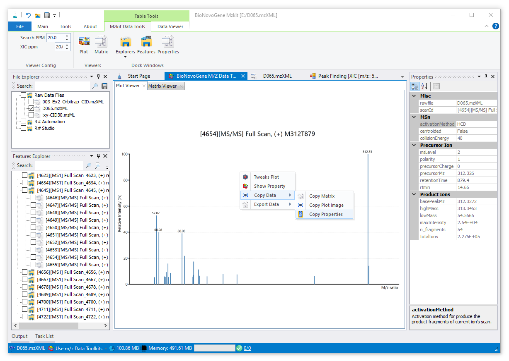

# 查看LC-MS原始数据文件

<!-- 2022-07-14 -->

## 数据准备工作：向mzkit中导入原始数据

我们在正式介绍怎样使用mzkit软件查看原始数据文件之前，会首先需要来学习一下是如何将原始数据文件导入到mzkit之中的。在mzkit软件之中，一般有几个文件夹样子的按钮可以用于导入LCMS靶向原始数据文件，例如下面这张PPT上所展示的：

> 请注意，当mzkit的文件浏览器之中没有任何原始数据文件的时候，程序在打开文件的时候会直接在前台导入文件；当已经存在原始数据文件之后，为了不影响你在前台界面查看其他的原始数据文件，mzkit会在后台创建文件的导入任务。

+ 我们可以通过Ribbon菜单之中的【Open】按钮打开单个原始数据文件到mzkit软件之中
+ 也可以通过【File Explorer】中的文件导入功能，进行原始数据文件的批量导入操作

## 查看色谱图

在这里我假设大家都已经成功的导入了原始数据文件了。色谱图的查看，主要是基于我们的一级质谱结果来完成的。在色谱图中，根据数据的来源，主要分为三种色谱图：总离子流色谱图，基峰图和提取离子流色谱图。

### 总离子流色谱图（TIC）

总离子流色谱图就是将每一个一级扫描帧之中的所有离子的信号响应值的总和对保留时间作图即可。在MZKit之中，可以通过下面方式进行TIC色谱图的查看操作：

1. 在【文件浏览器】中选中一个原始数据文件，在Ribbon菜单栏上的【数据查看器】中点击【TIC】按钮即可
2. 或者在打开一个原始数据文件之后，在【对象浏览器】之中通过鼠标右键菜单依次点击【色谱图】->【显示TIC色谱图】即可显示

### 基峰图（BPC）

基峰图与总离子流色谱图类似，只不过基峰图是将每一个一级扫描帧之中的最大的离子信号响应值拿出来对保留时间进行作图。查看的操作过程与TIC色谱图的查看操作过程一致，只需要按照上面的步骤，选择对应的BPC按钮即可：

### 提取离子流色谱图（XIC）

提取离子流色谱图则是针对特定的m/z值的离子在每一个一级扫描帧之中的对应的离子信号响应值拿出来对保留时间作图。因为涉及到针对一级母离子的选择操作，所以需要在【对象浏览器】之中，展开对应的二级质谱图节点，选中之后，通过右键菜单选择【显示XIC谱图】即可：

如果继续点击二级菜单里面的【峰查找】菜单项的话，则会针对当前的XIC色谱图进行峰识别一级峰查找操作，基于此结果可以获取得到当前的目标离子的表达组成情况。

### 查看TIC/BPC叠加图

基于TIC或者BPC叠加图，可以比较多个样本原始数据之间的变异情况。在MZKit的【文件浏览器】之中，选中多个原始数据文件，在文件夹上通过鼠标右键菜单依次点击【色谱图叠加】->【BPC叠加图】或者【TIC叠加图】即可查看：

## 查看质谱图

在这里主要介绍针对质谱图的数据查看操作。在质谱图数据查看之中，我们可以针对常见的一级质谱图和二级质谱图进行数据查看。

### 一级母离子散点图

一级母离子散点图是一个基于一级母离子的质谱离子三维信息所绘制的散点图：

+ X坐标轴为一级母离子的保留时间
+ Y坐标轴为一级母离子的质荷比值
+ 第三个维度则是散点的颜色，其表示相应的离子的信号响应值强度

因为在导入原始数据的时候，对应的一级母离子散点图一般已经自动计算好了，所以我们只需要在【文件浏览器】之中点击相应的原始数据文件即可查看对应的一级母离子散点图。

基于一级母离子散点图，一般可以比较直观的查看到在原始数据之中的离子分布情况。散点图上面的空白位置，表示对应的位置处没有离子被扫描出来或者信号响应值很低。

### 查看一级质谱图与二级质谱图

我们只需要在【对象浏览器】之中点击相应的节点即可方便的查看对应的一级质谱图或者二级质谱图。在【对象浏览器】之中，文件夹图标的节点对象为一级质谱图。每一个一级质谱图之中的某一些响应度值特别高的母离子，会因为会被继续碎裂产生二级质谱图，所以在一级质谱图节点中还会包含有若干二级质谱图节点。点击即可查看相应的二级质谱图数据。

### 复制质谱图数据

如果需要将质谱图数据复制到Excel表格之中，可以在左边的图像查看器上通过右键菜单【复制数据】完成相应的操作：

+ 【复制矩阵】菜单会复制当前作图的质谱矩阵数据至剪切板之中
+ 【复制图像】菜单会复制当前的原始数据可视化结果图像至剪切板之中
+ 【复制属性】菜单会复制当前的质谱数据对象的属性信息至剪切板之中

在通过相应的菜单完成数据的复制操作之后，打开Excel程序，按下【Ctrl+V】粘贴数据上去即可。