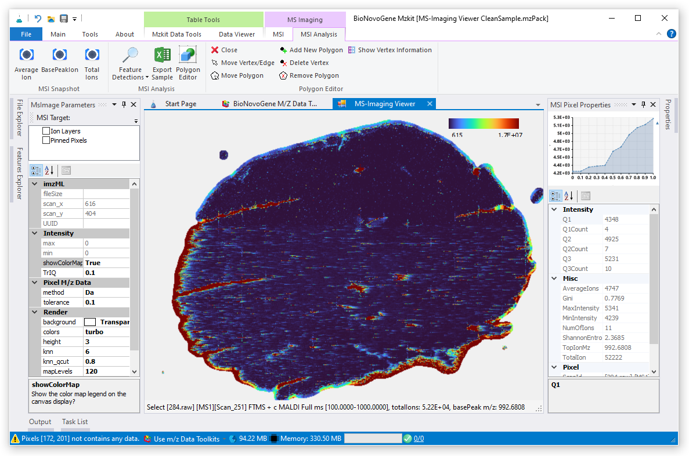
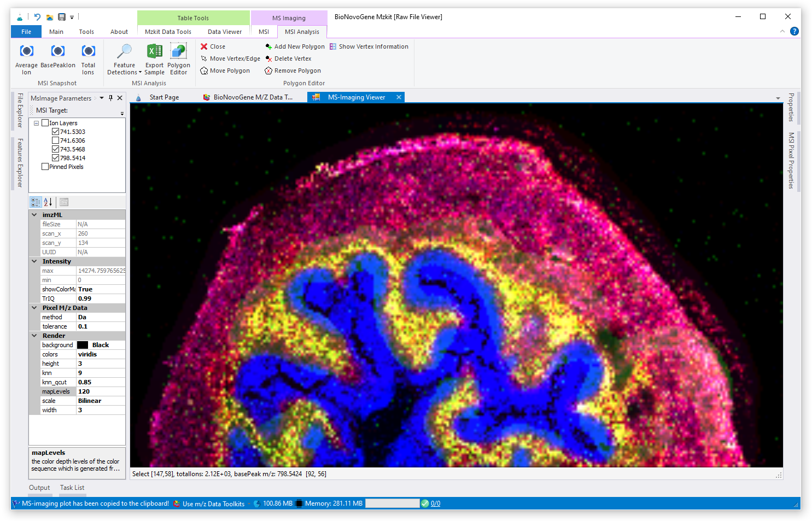

# 查看质谱成像原始数据文件

<!-- 2022-07-14 -->

质谱成像原始数据是LCMS原始数据的一个变种：对于质谱成像原始数据，其就是在LCMS原始数据之中将保留时间换算为对应的X坐标轴，具备了空间坐标信息，即可转换为质谱成像原始数据。对于按照普通LCMS非靶向原始数据查看方式查看质谱成像原始数据，可以按照帮助文档[《查看LC-MS原始数据文件》](/zh/#view-lc-ms)中的步骤来执行。

首先会需要通过顶部的菜单栏中的【MZKit数据工具】中的【浏览器】下拉框中选择【质谱成像查看器】打开：

## 导入原始数据文件

在所打开的质谱成像查看器界面上，可以看见顶部的菜单栏之中，左边存在有两排按钮。我们可以基于这些按钮进行质谱成像原始数据文件的打开。

### 1. 打开原始数据文件

直接点击左上角的【打开质谱成像文件】文件夹按钮，即可以弹出质谱成像原始数据文件打开对话框。从对话框的文件类型筛选器之中可以看见，MZKit可以支持直接打开如下格式的质谱成像原始数据文件：

1. 赛默飞的质谱成像原始数据Raw文件
2. imzML开源格式的质谱成像原始数据文件
3. MZKit所导出的质谱成像离子图层CDF原始数据文件
4. 以及诺米代谢的mzPack原始数据文件

在上面的对话框之中，选中目标原始数据文件后，点击【确定】打开文件即可

### 2. 合并原始数据

对于实验室中下机的最原始的质谱成像数据文件，一般是按照行扫描的形式分开为多个原始数据文件进行数据存储。为了方便进行数据的保存和转移，一般会需要对原始数据文件进行合并转储。在MZKit软件之中进行质谱成像原始数据文件的合并转储，可以通过第二列按钮之中的【合并行扫描】按钮进行操作：

1. 第一步，点击【合并行扫描】按钮打开文件选择对话框
2. 在文件对话框中浏览至目标原始数据文件夹位置
3. 可以通过【Ctrl+A】全选中所有行扫描Raw原始数据文件
4. 点击文件选择对话框之中的【打开】按钮，等待MZKit工作站完成质谱成像行扫描原始数据合并操作过程

## 查看样本概览图

MZKit工作站在加载完质谱成像原始数据之后，会首先将基峰离子的质谱成像图作为样本原始数据概览显示在软件界面上。

在MZKit工作站软件顶部的Ribbon菜单栏的【质谱成像数据分析】菜单之中，左边具有三个按钮可以进行质谱成像样本原始数据概览图的三种计算模式之间的相互切换：

+ 【信号均值质谱成像】 将每一个像素点的离子信号值取平均值之后进行质谱成像热图的渲染绘制
+ 【信号基峰质谱成像】将每一个像素点的离子信号值取最大值之后进行质谱成像热图的渲染绘制
+ 【总离子信号质谱成像】将每一个像素点的离子信号求取总和之后进行质谱成像热图的渲染绘制

## 查看单个离子的质谱成像

通过在【质谱成像参数】调整模块中输入对应离子的m/z值，之后点击输入框右边的【放大镜】按钮即可查看单个离子的质谱成像结果热图：

基于单离子质谱成像图，可以比较直观的观察到代谢物在整个生物样本上的二维空间之中的位置特异性分布情况

## 查看三个离子的质谱成像

如果需要查看两个离子或者三个离子在样本上的共表达定位情况，则可以通过三离子质谱成像叠加图来完成。在这个质谱成像图之中，两个或者三个离子各自的信号响应值分别被映射入GDI+颜色对象的R，G，B三个三原色通道之中。经过同一个像素点上的三个离子对应的信号值组成情况，在三原色的基础上混合出不同的颜色用以表示所查看的两个或者三个离子的共表达共定位情况。

三原色质谱成像叠加图的查看操作要稍微复杂一些：在左上角的离子列表中，选中多个目标离子；之后通过右键快捷菜单【多图层组合叠加渲染】操作，会弹出一个【颜色通道设置】的对话框。在这个对话框之中，我们分别对三原色RGB通道设置好对应的离子m/z即可。

> 一般黑色像素点表示对应的位置所查看的三种离子都不存在对应的代谢物表达；显示为红蓝绿三原色的任意一种颜色的像素点则表明该像素点位置仅存在有某一种代谢物的特异性表达；对于其他的颜色情况，则来自于三种离子在不同的信号响应值组合叠加的情况。
